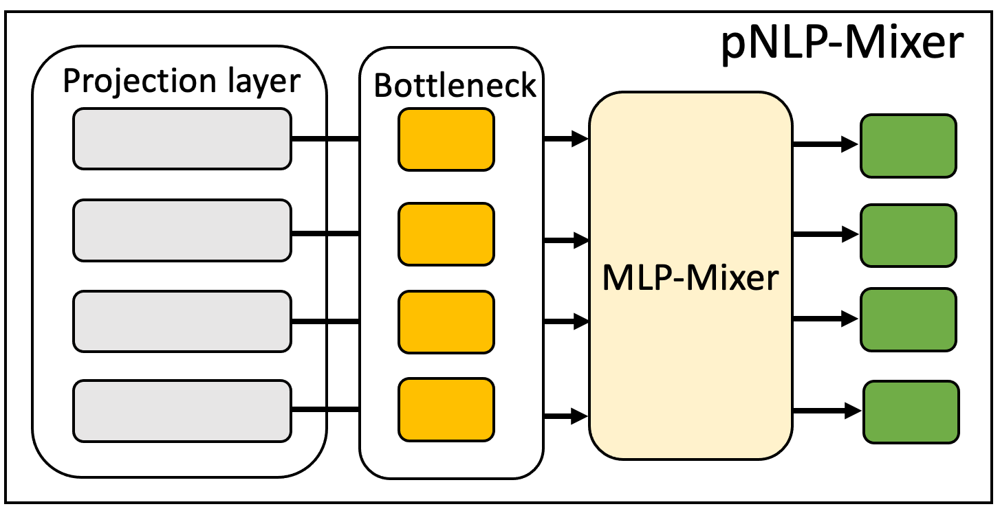

# pNLP-Mixer - Unofficial PyTorch Implementation

**pNLP-Mixer: an Efficient all-MLP Architecture for Language**

Implementation of [pNLP-Mixer](https://arxiv.org/abs/2202.04350) in PyTorch and [PyTorch Lightning](https://www.pytorchlightning.ai/).

pNLP-Mixer is the first successful application of the MLP-Mixer architecture in NLP.  With a novel embedding-free projection layer, pNLP-Mixer shows performance comparable to transformer-based models (e.g. mBERT, RoBERTa) with significantly smaller parameter count and no expensive pretraining procedures. 


<div align="center">
<p align="center">

</p>

**Fig. 1** of [pNLP-Mixer: an Efficient all-MLP Architecture for Language](https://arxiv.org/abs/2202.04350)

[](https://github.com/mindslab-ai/pnlp-mixer/issues)
[](https://github.com/mindslab-ai/pnlp-mixer/stargazers)
[](https://github.com/mindslab-ai/pnlp-mixer/commits/master)


</div>

## Requirements

* Python >= 3.6.10
* PyTorch >= 1.8.0
* PyTorch Lightning >= 1.4.3
* All other requirements are listed in the [`requirements.txt`](./requirements.txt) file.

## Configurations

Please check configuration examples and also comments in the [`cfg`](./cfg) directory.

## Commands

### Caching Vocab Hashes

```bash
python projection.py -v VOCAB_FILE -c CFG_PATH -g NGRAM_SIZE -o OUTPUT_FILE
```

* `VOCAB_FILE`: path to the vocab file that contains 
* `CFG_PATH`: path to the configurations file
* `NGRAM_SIZE`: size of n-grams used during hashing
* `OUTPUT_FILE`: path where the resulting `.npy` file will be stored

### Training / Testing

```bash
python run.py -c CFG_PATH -n MODEL_NAME -m MODE -p CKPT_PATH
```

* `CFG_PATH`: path to the configurations file
* `MODEL_NAME`: model name to be used for pytorch lightning logging
* `MODE`: `train` or `test` (default: `train`)
* `CKPT_PATH`: (optional) checkpoint path to resume training from or to use for testing

## Results

The checkpoints used for evaluation are available [here](https://drive.google.com/drive/folders/1WjXU-PWdPtoAr0sU4RfWh_mMSnw_vnr4?usp=sharing).

### MTOP

| Model Size                                                   | Reported | Ours  |
| ------------------------------------------------------------ | -------- | :---- |
| [pNLP-Mixer X-Small](https://drive.google.com/file/d/13v5-RUtug3TJtLl1amwAfOiQCrQZzZse/view?usp=sharing) | 76.9%    | 79.3% |
| [pNLP-Mixer Base](https://drive.google.com/file/d/15HT1OnKgurR8p9XAcwVcxd8WkOIvJ4Zp/view?usp=sharing) | 80.8%    | 79.4% |
| [pNLP-Mixer X-Large](https://drive.google.com/file/d/1tUYXbdHEA_sY_U6sgGg9F4IWjz8DyHOI/view?usp=sharing) | 82.3%    | 82.1% |

### MultiATIS

| Model Size                                                   | Reported | Ours  |
| ------------------------------------------------------------ | -------- | :---- |
| [pNLP-Mixer X-Small](https://drive.google.com/file/d/1Lmh0bEETVEZ_JBSbvOU39Sqd5JkIeTd1/view?usp=sharing) | 90.0%    | 91.3% |
| [pNLP-Mixer Base](https://drive.google.com/file/d/1UD6GpuOUdsAaZ48tT6LF9nCe_Jf-MwkT/view?usp=sharing) | 92.1%    | 92.8% |
| [pNLP-Mixer X-Large](https://drive.google.com/file/d/1M2muPWT2twPsOhDWDPvJthTFNYdulygh/view?usp=sharing) | 91.3%    | 92.9% |

\* Note that the paper reports the performance on the MultiATIS dataset using a 8-bit quantized model, whereas our performance was measured using a 32-bit float model. 

### IMDB

| Model Size                                                   | Reported | Ours  |
| ------------------------------------------------------------ | -------- | :---- |
| [pNLP-Mixer X-Small](https://drive.google.com/file/d/1g665UEzBW1b3sO9dvEV58lEfN1G3YJP3/view?usp=sharing) | 81.9%    | 81.5% |
| [pNLP-Mixer Base](https://drive.google.com/file/d/1bu3KDWPmINLDtqquwl590oq8Z8m5tq4H/view?usp=sharing) | 78.6%    | 82.2% |
| [pNLP-Mixer X-Large](https://drive.google.com/file/d/1cWVg5CdzKoqPFFxIyvexPJqncQK0G8ii/view?usp=sharing) | 82.9%    | 82.9% |

## Paper

```latex
@article{fusco2022pnlp,
  title={pNLP-Mixer: an Efficient all-MLP Architecture for Language},
  author={Fusco, Francesco and Pascual, Damian and Staar, Peter},
  journal={arXiv preprint arXiv:2202.04350},
  year={2022}
}
```

## Contributors

* [Tony Woo](https://github.com/tonyswoo) @ MINDsLab Inc. ([shwoo@mindslab.ai](mailto:shwoo@mindslab.ai))

Special thanks to: 

* [Hyoung-Kyu Song](https://github.com/deepkyu) @ MINDsLab Inc. 
* [Kang-wook Kim](https://github.com/wookladin) @ MINDsLab Inc.

## TODO

- [ ] 8-bit quantization
